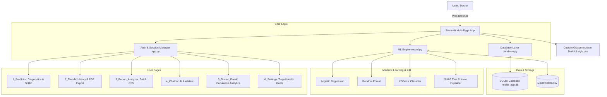

# 🏥 Enterprise Health Risk Predictor & Diagnostic Platform

[](https://www.python.org/)
[](https://streamlit.io/)
[](https://scikit-learn.org/)
[](https://xgboost.readthedocs.io/)
[](https://shap.readthedocs.io/)
[](LICENSE)

An end-to-end, AI-powered healthcare analytics and risk-prediction platform built with **Python**, **Streamlit**, and **Machine Learning**. It delivers predictive cardiovascular risk assessments, explainable AI insights via SHAP, real-time wearable data emulation, longitudinal trend tracking, batch patient report processing, an interactive AI healthcare chatbot, a role-protected Doctor Administration Portal, and downloadable clinical PDF reports.

---

## 📑 Table of Contents

- [Key Features](#-key-features)
- [System Architecture](#-system-architecture)
- [Tech Stack](#-tech-stack)
- [Project Structure](#-project-structure)
- [Machine Learning & Explainability](#-machine-learning--explainability)
- [Getting Started](#-getting-started)
  - [Prerequisites](#prerequisites)
  - [Installation](#installation)
  - [Running the Application](#running-the-application)
- [User Roles & Walkthrough](#-user-roles--walkthrough)
  - [Patient Experience](#1-patient-experience)
  - [Doctor Experience](#2-doctor-experience)
- [Database Schema](#-database-schema)
- [Medical Disclaimer](#-medical-disclaimer)
- [License](#-license)

---

## 🌟 Key Features

### 🔐 1. Role-Based Access Control & Authentication
- Secure SQLite database authentication with **SHA-256 password hashing**.
- Distinct roles for **Patients** and **Doctors** with role-gated page views.
- Persistent user state across all pages in the session.

### 🩺 2. Real-Time Diagnostic Dashboard (`pages/1_Predictor.py`)
- **Wearable Sensor Integration (Emulated)**: Sync live biometric streams (Heart Rate, Steps, Caloric Burn) simulating Garmin / Apple Health feeds.
- **Biometric Inputs**: Age, Weight, Height, Blood Pressure, Blood Glucose, and Serum Cholesterol.
- **Instant Metrics**: Automatic calculation of **BMI** and a composite **Health Score (0–100)**.
- **Multi-Model Risk Classification**: Toggle between **Random Forest**, **XGBoost**, and **Logistic Regression** to receive real-time risk classification (`Low`, `Medium`, `High`) with prediction confidence percentages.
- **Plotly Visual Gauges**: Interactive speedometer-style indicators displaying composite health score and confidence interval.
- **Explainable AI (SHAP)**: Feature contribution breakdown (SHAP values) showing exactly which biometric factors pushed the risk score higher or lower.

### 📈 3. Longitudinal Trend Tracking & PDF Export (`pages/2_Trends.py`)
- **Historical Analysis**: Time-series charts visualizing Health Score progression, BP, glucose, and cholesterol over time.
- **Goal vs. Actual Comparison**: Visual tracking of BMI against user-customized target milestones.
- **One-Click Clinical PDF Export**: Generate formatted, download-ready PDF summaries (`FPDF2`) to share with primary care physicians.

### 📁 4. Batch Cohort Report Analyzer (`pages/3_Report_Analyzer.py`)
- Upload CSV spreadsheets containing multi-patient health records.
- Automated batch inference running the trained Random Forest model.
- Visual summary including high-risk critical alert counters, cohort distribution pie charts, and downloadable annotated CSVs.

### 💬 5. AI Healthcare Assistant (`pages/4_Chatbot.py`)
- Conversational chat interface with simulated streaming responses.
- Provides immediate evidence-based guidance on blood pressure management, cholesterol reduction, glycemic control, BMI targets, and sleep hygiene.

### 👨‍⚕️ 6. Doctor Administration Portal (`pages/5_Doctor_Portal.py`)
- Role-restricted portal for authorized healthcare professionals.
- Population-level analytics: total active patients, critical high-risk cases, and overall system average health scores.
- Global risk distribution breakdowns and searchable, sortable patient logs.

### ⚙️ 7. Profile & Target Settings (`pages/6_Settings.py`)
- Set custom target weight (kg) and target BMI.
- Automatically connects to trend tracking charts to measure goal attainment over time.

---

## 🏗️ System Architecture



---

## 🛠️ Tech Stack

| Category | Technology |
|---|---|
| **Frontend & UI** | [Streamlit](https://streamlit.io/), Custom CSS (Glassmorphism, Dark Theme, Google Outfit Font) |
| **Machine Learning** | [Scikit-learn](https://scikit-learn.org/), [XGBoost](https://xgboost.readthedocs.io/) |
| **Explainable AI (XAI)** | [SHAP (SHapley Additive exPlanations)](https://shap.readthedocs.io/) |
| **Data Processing** | [Pandas](https://pandas.pydata.org/), [NumPy](https://numpy.org/) |
| **Data Visualization** | [Plotly Express & Graph Objects](https://plotly.com/python/) |
| **Database** | [SQLite3](https://www.sqlite.org/) |
| **Document Generation** | [FPDF2](https://py-pdf.github.io/fpdf2/) |

---

## 📁 Project Structure

```text
health-risk-predictor/
│
├── app.py                     # Entry point & authentication (Login/Register)
├── model.py                   # Model training, inference, BMI & SHAP explainers
├── database.py                # SQLite schema, user auth & history tracking
├── style.css                  # Custom glassmorphic animated UI styles
├── requirements.txt           # Python package dependencies
├── data.csv                   # Historical training dataset
├── health_app.db              # SQLite database (auto-generated)
│
└── pages/
    ├── 1_Predictor.py         # Real-time diagnostic inputs, gauges & SHAP analysis
    ├── 2_Trends.py            # Historical progression plots & PDF report generation
    ├── 3_Report_Analyzer.py   # Bulk CSV upload and cohort analysis
    ├── 4_Chatbot.py           # Interactive conversational health assistant
    ├── 5_Doctor_Portal.py     # Physician analytics dashboard (Role-protected)
    └── 6_Settings.py          # Patient goals & target metrics configuration
```

---

## 🧠 Machine Learning & Explainability

### Models Implemented
1. **Random Forest Classifier**: Primary ensemble model providing high predictive accuracy and resilient tree-based voting.
2. **XGBoost Classifier**: Gradient boosted decision trees optimized for subtle tabular feature interactions.
3. **Logistic Regression**: Linear baseline with balanced class weights for direct interpretability.

### Input Features & Transformation
- **Features**: `age`, `bp` (Blood Pressure mmHg), `sugar` (Blood Glucose mg/dL), `cholesterol` (mg/dL).
- **Preprocessing**: `StandardScaler` normalization and `LabelEncoder` class mapping.
- **Classes**: `Low (0)`, `Medium (1)`, `High (2)`.

### Explainable AI (SHAP)
Rather than acting as a black box, the platform utilizes `shap.TreeExplainer` and `shap.LinearExplainer` to compute exact feature attribution scores for every individual prediction, visually indicating which specific biometric indicators contributed most to elevated risk.

---

## 🚀 Getting Started

### Prerequisites
- **Python 3.10+** installed on your system.
- **Git** installed on your system.

### Installation

1. **Clone the repository**:
   ```bash
   git clone https://github.com/RidaFathima21153/health-risk-predictor.git
   cd health-risk-predictor
   ```

2. **Create and activate a virtual environment**:
   - **Windows (PowerShell)**:
     ```powershell
     python -m venv venv
     .\venv\Scripts\Activate.ps1
     ```
   - **macOS / Linux**:
     ```bash
     python3 -m venv venv
     source venv/bin/activate
     ```

3. **Install dependencies**:
   ```bash
   pip install -r requirements.txt
   ```

### Running the Application

Launch the Streamlit web application:
```bash
streamlit run app.py
```
Open your browser and navigate to `http://localhost:8501`.

---

## 👥 User Roles & Walkthrough

### 1. Patient Experience
1. **Register**: Sign up with username, password, and select role `Patient`.
2. **Set Targets**: Visit **⚙️ Settings** to define your target weight and BMI.
3. **Run Assessment**: Head to **🏥 Predictor**, optionally click `Sync Wearable`, input your latest vitals, select your preferred ML engine, and click `Run Diagnostics`.
4. **Inspect XAI**: Review your Health Score gauge, risk level, and review the SHAP chart to see which biometric markers require attention.
5. **View History & Export**: Navigate to **📈 Trends** to monitor long-term charts and download an official PDF report.
6. **Consult AI**: Use **💬 Chatbot** to ask questions about diet, blood pressure, and cardiovascular health.

### 2. Doctor Experience
1. **Register/Login**: Sign up or log in with role `Doctor`.
2. **Doctor Portal**: Access the **👨‍⚕️ Doctor Portal** to review aggregated metrics across all registered patients, monitor high-risk case proportions, and inspect patient diagnostic histories.
3. **Cohort Screening**: Use **📁 Report Analyzer** to upload bulk patient CSV records and immediately generate triage classifications.

---

## 🗄️ Database Schema

The platform initializes an embedded SQLite database (`health_app.db`) with two main tables:

### `users` Table
| Column | Type | Description |
|---|---|---|
| `username` | TEXT (PK) | Unique user identifier |
| `password_hash` | TEXT | SHA-256 encrypted password |
| `role` | TEXT | User role (`patient` or `doctor`) |
| `target_weight` | REAL | Target weight in kg |
| `target_bmi` | REAL | Target BMI milestone |

### `history` Table
| Column | Type | Description |
|---|---|---|
| `id` | INTEGER (PK AUTO) | Record ID |
| `username` | TEXT (FK) | Reference to `users.username` |
| `timestamp` | DATETIME | Assessment timestamp |
| `age`, `bp`, `sugar`, `cholesterol` | REAL | Recorded vitals |
| `bmi`, `health_score` | REAL | Calculated metrics |
| `risk_pred` | TEXT | Prediction (`Low`, `Medium`, `High`) |
| `model_used` | TEXT | Engine employed (e.g. Random Forest) |

---

## ⚠️ Medical Disclaimer

> [!WARNING]
> This software and its predictive models are designed strictly for **educational, experimental, and research screening purposes**. It does **not** constitute medical advice, clinical diagnosis, or treatment recommendations. Always seek the advice of a qualified physician or healthcare provider regarding any medical condition.

---

## 📄 License

This project is licensed under the [MIT License](LICENSE).
